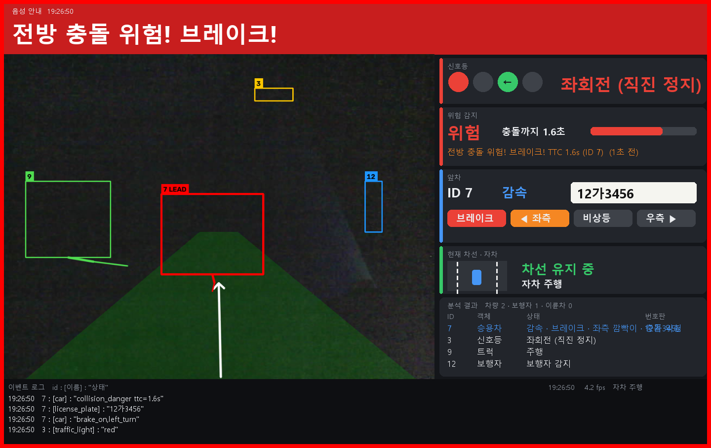

# car_siginal_detector

ESP32-S3 + OV3660 카메라 영상을 PC에서 분석하는 운전 보조 프로젝트입니다. 인식하는 항목은 다음과 같습니다.
- 한국 신호등
- 앞차 번호판, 브레이크등, 방향지시등, 주행 상태
- 차선 이탈, 충돌 위험, 끼어들기

결과는 **한국어 음성**과 **운전 상황 모니터**로 알려주고, `id : [이름] : "상태"` 형식의 로그로 남깁니다.



```powershell
python -m venv .venv
.\.venv\Scripts\python.exe -m pip install -r requirements.txt
.\.venv\Scripts\python.exe tools\fetch_models.py
.\.venv\Scripts\python.exe -m csd --show        # 카메라 + 음성 + 모니터
.\.venv\Scripts\python.exe -m pytest -q         # 테스트
```

| 문서 | 내용 |
|---|---|
| [CHANGELOG.md](CHANGELOG.md) | 버전 기록 (v0.1 ~ v0.3) |
| [HANDOVER.md](HANDOVER.md) | **인수인계서**: 현재 상태, 실행 방법, 환경 특이사항, 알려진 문제, 다음 할 일 |
| [DEMO.md](DEMO.md) | **차량 시연 절차**: `demo.bat`, 카메라 자체 Wi-Fi 연결, 음성 라벨링, `train.bat` |
| [app_spec.md](app_spec.md) | 앱 기능 명세 |
| [research.md](research.md) | 인식 방법 조사 (근거, 수치, 라이선스) |
| [architech.md](architech.md) | 기술 스택과 구조 |
| [dev_plan.md](dev_plan.md) | 개발 계획 (마이크로 단계)과 진행 상태 |
| [history.md](history.md) | 작업 이력 |

라이선스 주의: 검출기로 쓰는 Ultralytics YOLO는 AGPL-3.0입니다. 자세한 내용은 research.md 11장을 참고하세요.
