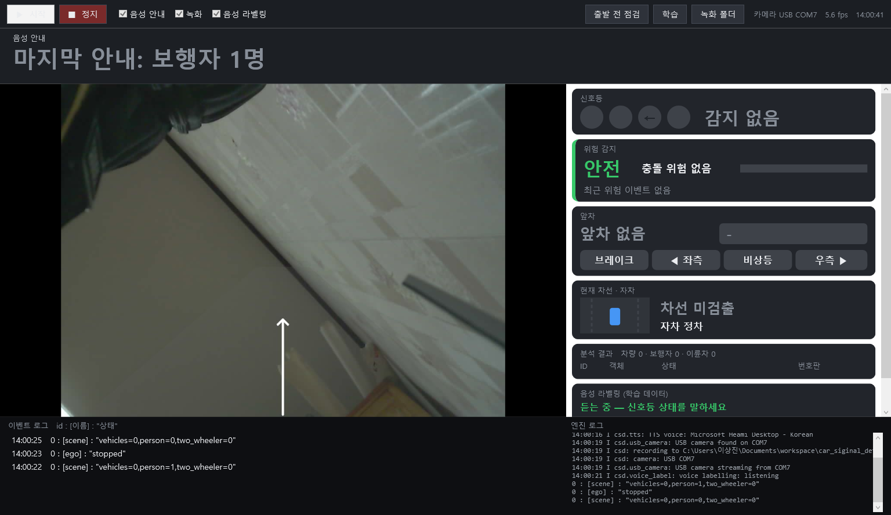

# windows_app — 네이티브 Windows 앱 (운전 상황 모니터)

C# **WPF (.NET 8)** 데스크톱 앱입니다. 인식 엔진은 기존 Python 코드(`csd`)를 창 없이 백그라운드로 실행하고, 이 앱이 영상·상황판·로그를 보여주며 시작·정지와 옵션을 제어합니다.



```
CarSignalDetector.exe (WPF)
   │ 시작:  .venv\Scripts\python.exe -m csd --serve <빈 포트> --name app [--no-voice] [--record] [--label-voice]
   │ 0.2초마다  GET /state   (상태 JSON, 한국어 문구 포함)
   │ 새 프레임  GET /frame.jpg (박스·궤적·차선이 그려진 영상)
   │ 정지:      POST /shutdown (녹화·라벨 저장 후 종료, 10초 안에 안 끝나면 강제 종료)
   ▼
Python 엔진 (csd/server.py, 127.0.0.1에만 열림)
```

## 빌드와 실행

| 할 일 | 방법 |
|---|---|
| 빌드 | `windows_app\build.bat` → `windows_app\publish\CarSignalDetector.exe` (약 200KB) |
| 실행 | `publish\CarSignalDetector.exe` 더블클릭 → **▶ 시작** (F5), **■ 정지** (Esc) |
| 바탕화면 바로가기 | `windows_app\make_shortcut.bat` → "운전 상황 모니터", "운전 상황 모니터 (자동 시작)" |

- 필요한 것:
  - 실행에는 **.NET 8 데스크톱 런타임**이 있어야 합니다. 이 PC에는 8.0.31이 있습니다.
  - 빌드에는 .NET 8 SDK가 필요합니다.
  - 저장소 루트의 `.venv`(Python 엔진)와 `models/`가 있어야 합니다. `HANDOVER.md` 4.1장을 참고하세요.
- exe는 자기 위치에서 위쪽 폴더로 올라가며 `csd\__main__.py`가 있는 폴더를 찾습니다. 그 폴더가 프로젝트 루트입니다. 그래서 `publish` 폴더를 저장소 밖으로 옮기면 동작하지 않습니다(바로가기는 괜찮습니다).

## 화면

| 영역 | 내용 |
|---|---|
| 도구 모음 | 시작/정지, 옵션(음성 안내 · 녹화 · 음성 라벨링), 출발 전 점검(콘솔 창), 학습(`train.bat`), 녹화 폴더, 카메라 연결·fps |
| 음성 자막 | 마지막 음성 안내를 5초간 큰 글씨로 표시. 배경색은 위험도별로 빨강(위험), 주황(경고), 파랑(신호), 회색(정보) |
| 영상 | 엔진이 그린 박스·ID·LEAD·이동 궤적·차선·진행 방향 |
| 상황판 | 신호등 램프(점멸은 깜빡임), 위험 감지(TTC 게이지), 앞차(ID·주행 상태·번호판·등화 칩), 차선 안 자차 위치, 분석 결과 표, 음성 라벨링 상태 |
| 로그 | 이벤트 로그(`id : [이름] : "상태"`), 엔진 로그 |

- 충돌 "위험"이면 창 테두리가 빨갛게 깜빡입니다.
- 창을 닫으면 엔진을 먼저 정상 정지(녹화 저장)한 뒤 닫힙니다.

## 명령줄 옵션

```
CarSignalDetector.exe --autostart                       창이 열리면 바로 시작
CarSignalDetector.exe --snapshot out.png --snapshot-after 25   25초 뒤 창을 PNG로 저장 (잠긴 화면에서도 동작)
CarSignalDetector.exe --exit-after 60                   60초 뒤 정상 정지 후 종료
```

2026-09-25 시험 결과(`--autostart --snapshot … --exit-after 32`):
- USB 카메라(COM7) 연결, 분석 5.6fps, 녹화 638프레임
- 스냅샷 저장
- 엔진이 정상 종료(코드 0)했고 `meta.json`까지 저장됐습니다. 남은 프로세스는 없었습니다.

## 파일

| 파일 | 역할 |
|---|---|
| `CsdApp/MainWindow.xaml(.cs)` | 화면과 갱신 로직 |
| `CsdApp/Engine.cs` | 엔진 프로세스 실행·정지, HTTP 통신, 빈 포트 선택, 콘솔 도구 실행 |
| `CsdApp/EngineState.cs` | `/state` JSON 모델 (`csd/server.py` `build_state`와 짝) |
| `build.bat`, `make_shortcut.bat` | 빌드, 바탕화면 바로가기 |
